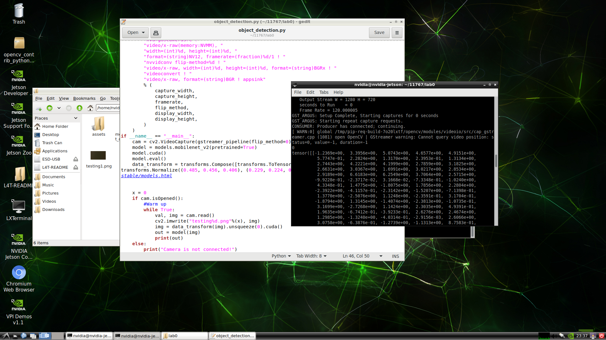

Lab 0: Hardware setup
===
The goal of this lab is for you to become more familiar with the hardware platform you will be working with this semester, and for you to complete basic setup so that everyone in the group should be able to work remotely on the device going forward. By the end of class today, everyone in your group should be able to ssh in to the device, use the camera to take a picture, record audio, run a basic NLP model, and run a basic CV model. 

If you successfully complete all those tasks, then your final task is to write a script that pipes together I/O with a model. For example, you could write a script that uses the camera to capture an image, then runs classification on that image. Or you could capture audio, run speech-to-text, then run sentiment analysis on that text.

Group name: 1 tsp of sugars and 3 eggs
---
Group members present in lab today: <b>Emily Wuu(cwuu), Raymond Lau(kwunfunl)</b>

1: Set up your device.
----
Depending on your hardware, follow the instructions provided in this directory: [Raspberry Pi 4](https://github.com/strubell/11-767/blob/main/labs/lab0-setup/setup-rpi4.md), [Jetson Nano](https://github.com/strubell/11-767/blob/main/labs/lab0-setup/setup-jetson.md), [Google Coral](https://coral.ai/docs/dev-board/get-started/). 
1. What device(s) are you setting up? <b>Jetson Nano</b>
2. Did you run into any roadblocks following the instructions? What happened, and what did you do to fix the problem? 
   </br>
   <b>It is going to take me 3 hours to download the Jetson ROM image.</b>
3. Are all group members now able to ssh in to the device from their laptops? If not, why not? How will this be resolved?
   </br>
   <b>No. It is due to the security settings of the CMU network. We switched the environment and use our own network to avoid this issue.</b>
   
2: Collaboration / hardware management plan
----
4. What is your group's hardware management plan? <br/>
<b>One groupmate who live close to the campus will keep the device. 
We plan to work on the project mostly on Tuesday and Thursday after the class. The working venue will be the study space in GHC, and we will do physical restart or debugging here. Since the device is kept in one of the groupmate's apartment, we will move the working venue to his place in the case of COVID lockdown.</b>

3: Putting it all together
----
5. Now, you should be able to take a picture, record audio, run a basic computer vision model, and run a basic NLP model. Now, write a script that pipes I/O to models. For example, write a script that takes a picture then runs a detection model on that image, and/or write a script that runs speech-to-text on audio, then performs classification on the resulting text.Include the script at the end of your lab report.

6. Describe what the script you wrote does (document it.) 
   <br/>
   <b>The script uses a pretrained model (mobilenet_v2) to perform object detection.
   First, it initialzes the camera object using OpenCV and the pretaiend model (retrieved from torchvision.models).
   Then for each frame that is retrieved from the camera, object detection is performed and the coordiantes of the bounding boxes are stored.
   Finally the tensor representing coordinates are printed in the console.</b>
   
7. Did you have any trouble getting this running? If so, describe what difficulties you ran into, and how you tried to resolve them.
   <br/>
   <b>Many of the original insturction given in setup.md is incorrect (eg. wrong open-cv package and pytorch vision without torchvision.) We solved most of the issues by following the discussion in the slack channel. Additionally, we also ran into the problem of unstable gstream, and slved it by looking into the original documents provided by the commmunit</b>

```
import torch
import torchvision.models as models
import cv2, os, sys
import torchvision.transforms as transforms
from torchvision.utils import make_grid

#ref: https://github.com/JetsonHacksNano/CSI-Camera/blob/master/simple_camera.py
def gstreamer_pipeline(
    capture_width=1280,
    capture_height=720,
    display_width=1280,
    display_height=720,
    framerate=60,
    flip_method=0,
):
    return (
        "nvarguscamerasrc ! "
        "video/x-raw(memory:NVMM), "
        "width=(int)%d, height=(int)%d, "
        "format=(string)NV12, framerate=(fraction)%d/1 ! "
        "nvvidconv flip-method=%d ! "
        "video/x-raw, width=(int)%d, height=(int)%d, format=(string)BGRx ! "
        "videoconvert ! "
        "video/x-raw, format=(string)BGR ! appsink"
        % (
            capture_width,
            capture_height,
            framerate,
            flip_method,
            display_width,
            display_height,
        )
    )
if __name__ == "__main__":
    cam = cv2.VideoCapture(gstreamer_pipeline(flip_method=0), cv2.CAP_GSTREAMER)
    model = models.mobilenet_v2(pretrained=True)
    model.cuda()
    model.eval()
    data_transform = transforms.Compose([transforms.ToTensor(), transforms.Resize((320, 320)), transforms.Normalize((0.485, 0.456, 0.406), (0.229, 0.224, 0.225))]) #ref: https://pytorch.org/vision/stable/models.html

    
    x = 0
    if cam.isOpened():
        #Warm up
        while True:
            val, img = cam.read()
            cv2.imwrite("testing%d.png"%(x), img)
            img = data_transform(img).unsqueeze(0).cuda()
            out = model(img)
            print(out)
    else:
        print("Camera is not connected!")
        ```
